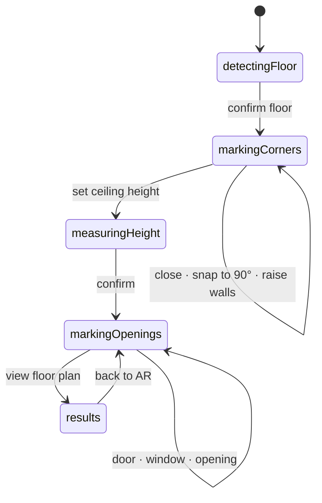

# RoomScan AR

**English** · [Português (Brasil)](README.pt-BR.md)

Augmented-reality room scanning for iOS. The user marks a room's corners by
pointing the phone; the app raises the walls in 3D, computes the measurements and
produces a 2D floor plan that exports to PDF.

Academic prototype for a Virtual and Augmented Reality course. No backend, no
authentication, no persistence — the geometry is the point.

The app's interface is in Brazilian Portuguese.

---

## The constraint that defines the project

**The target device is a standard iPhone 17, which has no LiDAR.**

That rules out the easy path. No `RoomPlan`, no `sceneReconstruction`, no
`ARMeshAnchor`, no `sceneUnderstanding`, no `sceneDepth` — every one of them
requires the sensor.

With no environment mesh, **the room geometry is computed by hand** from user
raycasts against the floor plane that ARKit detects through visual-inertial
odometry. That is the intellectual core of the project, and it is not
outsourced to a ready-made API.

Verified by grep at the end of every stage:

```bash
grep -rE "RoomPlan|sceneReconstruction|ARMeshAnchor|sceneUnderstanding|sceneDepth" \
  RoomScanAR --include="*.swift"
```

Zero hits in code — only in comments explaining the absence.

---

## Running it

**AR does not work in the Simulator.** The app runs on a physical iPhone only.
The math, however, is testable without a device (see [Tests](#tests)).

### Requirements

| | |
|---|---|
| Xcode | 16 or later |
| Swift | 6 (strict concurrency) |
| Deployment target | iOS 18.0 |
| External dependencies | none — no SPM, no CocoaPods |

### Step by step

1. **Enable Developer Mode on the iPhone** — first time only.
   `Settings → Privacy & Security → Developer Mode → on → restart`.

   Without it the app installs but **won't launch**, and the error is not
   informative.

2. **Connect the iPhone** with a data cable, unlocked. A charge-only USB-C cable
   won't do — the Mac never enumerates the device.

3. **Open the project and set up signing**

   ```bash
   open RoomScanAR.xcodeproj
   ```

   Under `Signing & Capabilities`, pick your Team. The default bundle id is
   `vc.bricker.RoomScanAR` — change it if it collides.

4. **Select the iPhone** in the destination picker and run with <kbd>⌘R</kbd>.

5. **Trust the developer certificate** — first time only.
   `Settings → General → VPN & Device Management → trust the certificate`.

6. **Grant camera access** on first launch.

### From the command line

```bash
# Build for device
xcodebuild -scheme RoomScanAR -destination 'generic/platform=iOS' \
  -allowProvisioningUpdates -derivedDataPath /tmp/rsar build

# Install onto the connected device
xcrun devicectl list devices
xcrun devicectl device install app --device <ID> \
  /tmp/rsar/Build/Products/Debug-iphoneos/RoomScanAR.app
```

### Conditions the tracking needs

Without LiDAR the tracking is purely visual, so the environment matters:

- **Light.** A dark room delays or prevents floor detection.
- **Texture on the floor.** Glossy white tile is the worst case; wood, rugs or
  patterned flooring work far better.
- **Slow, lateral movement.** Turning in place produces no parallax — take a few
  steps sideways while pointing at the floor.
- **Auto-Lock set to Never.** The AR session dies when the screen sleeps.

---

## Flow



Every transition is **explicit, driven by a button**. Nothing advances on its
own — an unexpected phase change mid-recording ruins the demo.

---

## How the geometry works

### Marking corners without an environment mesh

ARKit's raycast only hits where **detected plane geometry** already exists, which
covers just the patch of floor around the user. Aiming at a baseboard a few
metres away fails.

Because `floorY` is locked when the floor is confirmed, the floor plane is known
even where ARKit detected nothing. The intersection is analytic:

```
t = (floorY − origin.y) / direction.y
point = origin + t · direction
```

Resolution order, per frame:

1. Detected plane geometry hit, **if it sits at floor level** (±15 cm)
2. Analytic intersection with `y = floorY`
3. Estimated plane — only before the floor is locked

The level check in step 1 is not a detail: aiming across the room, a detected
table plane in the path would capture the ray and become a "corner".

### Area and perimeter

Floor area by the *shoelace* formula over X and Z:

```
A = |Σ (xᵢ · z₍ᵢ₊₁₎ − x₍ᵢ₊₁₎ · zᵢ)| / 2
```

Points are translated to the first vertex before summing, and accumulation is in
`Double`. In a long AR session the corners end up tens of metres from the origin;
multiplying large coordinates and then subtracting close values burns `Float`
precision exactly where it matters.

### Ceiling height

Three paths, none of them LiDAR-dependent. They coexist because they fail in
different situations.

**Point-by-point aiming.** There is no ceiling surface to raycast against, so the
camera ray is intersected with the infinite vertical plane of the aimed wall, and
the height comes from the difference between the intersection's Y and the floor's.
Since a sloped ceiling has no single height, measurements **accumulate**, with a
choice of minimum, average or maximum.

**Detected ceiling plane.** `planeDetection = [.horizontal]` already picks up
downward-facing planes, and ARKit classifies them as `.ceiling` — no LiDAR, just
feature-point clustering. When it exists it is the most reliable signal, and
becomes a one-tap button.

**Point-cloud sweep.** `ARFrame.rawFeaturePoints` yields sparse 3D points, also
without LiDAR. Sweeping the room, the height distribution describes the whole
ceiling — which is what a sloped ceiling demands, since a single number
represents nothing there.

The filter has three stages, and the order matters:

1. height within the plausible ceiling range;
2. inside the room polygon — discards what belongs to another space;
3. at least 35 cm away from the walls.

The third is what makes the result worth anything: wall points are also high and
also inside the room, and would pass the first two. Without it every wall would
contaminate the statistic.

The summary is reported as **10th/50th/90th percentiles**, not raw min and max.
The cloud is noisy, and one stray point on a light fixture or a loose beam would
drag the whole extreme with it.

Each feature point is counted **once**, by identifier — ARKit keeps the id stable
across frames. Without that, holding still while pointing at one corner would
multiply the weight of that patch of ceiling.

**Wall-ceiling junction.** A second reading of the same sweep, for when the
ceiling face has no texture: instead of discarding what sits near the wall, it
keeps only that.

Texture cannot be **simulated** in software. ARKit triangulates world-fixed
feature points by comparing frames taken from different positions; anything
projected — the torch, for instance — travels with the camera and yields no
landmark at all. A moving specular highlight actively degrades tracking.
Rendered AR content doesn't help either: the tracker sees the camera feed, not
what we draw on top of it.

What does exist is the **corner line**. Even a perfectly flat ceiling has a
shading discontinuity where it meets the wall, and walls carry far more texture
than ceilings — baseboards, outlets, picture frames, furniture pushed against
them.

The points collected there sit on the wall at varying heights; the ceiling is the
**top** of that distribution. Hence the 92nd percentile rather than the median —
and rather than the raw maximum, which would latch onto a curtain rail or an
isolated beam.

The two bands do not overlap: within 25 cm of the wall is junction, beyond 35 cm
is ceiling.

> What remains is the case where **not even the corner line** has contrast —
> ceiling and wall the same colour under diffuse light. There, only
> point-by-point aiming and the manual adjustment.

### 3D walls

The mesh is built at final height; the rise animates **Y scale** from ~0 to 1 with
the pivot on the floor. Visually identical to animating the vertices, without
regenerating the mesh every frame.

Triangles are emitted in **both winding orders**: the user stands inside the room
and needs to see the walls from within. That makes alpha compose twice — opacity
is calibrated per face, not by the perceived result.

The material is `UnlitMaterial`, not `PhysicallyBasedMaterial`. Under PBR,
`environmentTexturing` lights the wall, and a bright room **washes out** the
colour you set. Unlit delivers exactly the colour written, in any environment.

### Doors, windows and openings, without CSG

Four types: **door**, **sliding door**, **open passage** and **window**. Past
1.20 m of width the suggested type becomes a sliding door — a swing leaf that
size doesn't exist in practice.

RealityKit offers no practical boolean operation. Instead of cutting the mesh,
the wall is **split into panels** that go around the opening:

```
Door, sliding, passage  →  left panel | right panel | header
Window                  →  left panel | right panel | header | sill panel
```

Visually indistinguishable from a real cut-out, and far more robust.

Openings are marked by **two opposite corners on the wall plane** — the camera
ray is intersected with its vertical plane, which yields distance and height at
once. Width, sill and height all come from the two points, the same way corners
define the room polygon.

This also **diverges from the specification**, which calls for two points "along
the base". Marking on the base discards height by construction: it would have to
come from a default, and the rectangle would grow horizontally only — producing
proportions that don't match the real opening.

### Orthogonal snap

**Diverges from the specification, deliberately.** The spec asks for the residual
error to be distributed across the vertices — which closes the polygon but
reintroduces non-right angles, paying for the snap without ending up with exact
90°.

Since every segment ends up axis-aligned in the θ₀ frame after snapping, the
polygon is closed by adjusting **lengths only**: the sum of travel in one
direction is balanced against the opposite direction, per axis. Closure becomes
exact and the right angles survive.

Markings whose residual error exceeds 15% of the perimeter are rejected. The
operation is reversible.

### Floor plan

Drawn with SwiftUI's `Canvas`, in technical-drawing style: white background,
black stroke, no decorative colour.

**Automatic orientation.** ARKit's world origin has an arbitrary heading — it
depends on where the phone pointed when the session started. Drawing raw XZ
leaves the room skewed on the page, and the bounding box wastes space on the
diagonal. The plan rotates itself to align the **longest wall** to the horizontal.

**Manual rotation** on top of that, via two-finger gesture or 90° buttons. The
angle is summed inside `PlanTransform` rather than applied as a draw-time
transform: the bounding box is recomputed already rotated, so the plan keeps
filling the page at any orientation, rescaling as it turns.

Angles within 7° of a multiple of 90° snap to it. A technical plan almost always
wants orthogonal, and hitting exactly 90° with two fingers is impossible; the
tolerance is narrow enough not to hijack a deliberately oblique angle.

**The PDF comes out at the orientation on screen.** Rotating the view alone would
be pointless, since the reason to rotate is to export oriented.

**Dimension labels sit outside**, and the side is decided by a point-in-polygon
test — not by the sign of the area. Deriving it from the sign gets it wrong: the
area is computed in the mathematical convention, Y up, and applied on screen,
where Y grows downward. The flip swaps handedness and throws every label inside
the room.

The area label is only drawn at the centroid if it fits there with clearance for
the wall thickness; otherwise it moves outside the drawing, as a real plan does
for small spaces. The white backdrop behind labels erases whatever is underneath
— standard dimension-text convention — and letting it fall on a wall would punch
holes in the stroke.

**Vector PDF export.** `ImageRenderer` draws straight into a PDF `CGContext`
instead of producing a bitmap and wrapping it: lines and text stay sharp when
zoomed or printed.

---

## Architecture

```
RoomScanAR/
├── App/          RoomScanARApp
├── Models/       RoomScan · Opening · ScanPhase
├── Geometry/     PolygonMath · WallGeometry · WallMeshBuilder · OrthogonalSnap · CeilingEstimator
├── AR/           ARSessionManager · RaycastService · ARContainerView · RoomSceneRenderer
├── Views/        ScannerView · ReticleView · HUDView · FloorPlanView · ResultsView
└── Support/      Formatting · SIMDExtensions · PDFExporter
```

The decisions everything else rests on:

**`Geometry/` is pure.** Points in, numbers out. `PolygonMath`, `WallGeometry`,
`OrthogonalSnap` and `CeilingEstimator` import `simd` and nothing else — that is
what makes the math testable in the Simulator, with no device. (`WallMeshBuilder`
is the exception: it imports `RealityKit` because it produces `MeshResource`.)

**3D content hangs off an `ARAnchor` registered with the session.** Not
`AnchorEntity(world:)`, which is merely a fixed transform in the session frame and
receives no drift correction; and not a plane anchor, which ARKit *removes* when
it merges neighbouring planes, taking the child geometry with it.

It matters because when the user walks around the room and returns to the first
corner, ARKit performs *loop closure* and re-estimates the world frame by a few
centimetres. Unanchored geometry slides along with it, rigidly, relative to the
real room. A registered anchor receives the correction and carries the room with
it.

Since the anchor sits exactly at floor level, the floor is `y = 0` in its space —
nothing to convert, no value to keep in sync.

**Explicit `@MainActor` on AR and UI; `Geometry/` entirely `nonisolated`.** No
reliance on newer compiler flags, and callable from any context.

**The reticle publishes a coarse enum.** Publishing the raycast's `SIMD3` would
redraw SwiftUI 60×/s. Only the reticle colour needs to react; the exact point
stays out of `@Published`.

---

## Tests

72 tests across 13 suites, covering the pure geometry. ARKit is not tested — it
wouldn't make sense.

```bash
xcodebuild test -scheme RoomScanAR \
  -destination 'platform=iOS Simulator,name=iPhone 17'
```

They run in the **Simulator**, even though the app is device-only: that is the
payoff of isolating the geometry. For it to work the app merely has to *launch*
in the Simulator, which an `ARWorldTrackingConfiguration.isSupported` guard
ensures.

Cases worth calling out:

| Suite | What it protects |
|---|---|
| Shoelace area | 1 m² square, L-shaped polygon, winding independence, precision 1200 m from the origin |
| Point in polygon | Orients the plan's dimension labels; tested on the 4.28 × 0.87 m narrow room that produced the original defect |
| Orthogonal snap | Convergence to 90° on skewed squares and L shapes, exact closure, rejection of irregular shapes |
| Wall panels | Door, window, opening up to the ceiling, opening wider than the wall, two openings on one wall |
| Plan rotation | 90° snapping, preservation of deliberate oblique angles, normalisation of full turns |
| Ceiling estimation | Rejection of wall and furniture points, outlier resistance, flat vs. sloped ceiling |
| Distance to boundary | Projection clamped to the segment, not to the infinite line |

---

## Out of scope

Deliberately absent: multiple rooms, automatic furniture or wall detection,
persistence between sessions, `ARWorldMap`, backend, export to DXF, IFC or USDZ,
dark mode, localization beyond pt-BR, and VoiceOver accessibility.

## Known limitations

- **Openings can't be edited once created.** Only `Undo`, in reverse order.
- **Precision degrades with distance.** Past 6 m the reticle warns: 1° of camera
  pose error becomes ~10 cm of position error.
- **The ceiling sweep needs contrast somewhere.** A smooth slab produces no
  feature points on its face, and the reading then comes from the corner line with
  the wall. When not even the corner line has contrast — ceiling and wall the same
  colour under diffuse light — point-by-point aiming and manual adjustment are
  what's left.
- **A ray parallel to the floor never intersects the floor.** Aiming at the
  horizon or above marks no corner — that's geometry, not something to work
  around.
