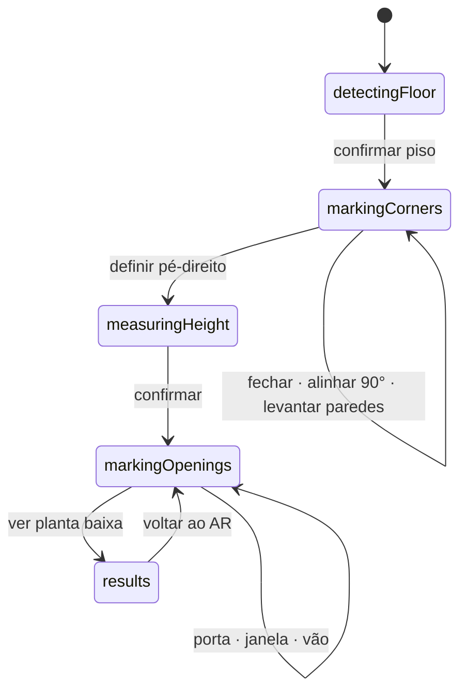

# RoomScan AR

**Português (Brasil)** · [English](README.md)

Digitalização de ambientes em Realidade Aumentada para iOS. O usuário marca os
cantos de um cômodo apontando o celular, e o app levanta as paredes em 3D,
calcula as medidas e gera uma planta baixa 2D exportável em PDF.

Protótipo acadêmico da disciplina de Realidade Virtual e Aumentada. Sem backend,
autenticação ou persistência — o foco é a geometria.

---

## A restrição que define o projeto

**O aparelho alvo é um iPhone 17 padrão, que não possui LiDAR.**

Isso elimina o caminho fácil. Nada de `RoomPlan`, `sceneReconstruction`,
`ARMeshAnchor`, `sceneUnderstanding` ou `sceneDepth` — todos exigem o sensor.

Sem malha do ambiente, **a geometria do cômodo é calculada manualmente** a partir
de raycasts do usuário contra o plano do piso detectado pelo ARKit por odometria
visual-inercial. É o núcleo intelectual do projeto, e não está terceirizado para
nenhuma API pronta.

Verificação por grep, ao final de cada etapa:

```bash
grep -rE "RoomPlan|sceneReconstruction|ARMeshAnchor|sceneUnderstanding|sceneDepth" \
  RoomScanAR --include="*.swift"
```

Zero ocorrências em código — só em comentários que explicam a ausência.

---

## Como rodar

**AR não funciona no Simulator.** O app só roda em iPhone físico. A matemática,
porém, é testável sem aparelho (ver [Testes](#testes)).

### Requisitos

| | |
|---|---|
| Xcode | 16 ou superior |
| Swift | 6 (concorrência estrita) |
| Deployment target | iOS 18.0 |
| Dependências externas | nenhuma — sem SPM, sem CocoaPods |

### Passo a passo

1. **Ativar o Modo de Desenvolvedor no iPhone** — só na primeira vez.
   `Ajustes → Privacidade e Segurança → Modo de Desenvolvedor → ligar → reiniciar`.

   Sem isso o app instala mas **não abre**, e o erro não é claro.

2. **Conectar o iPhone** por cabo de dados, com o aparelho desbloqueado.
   Cabo USB-C de carga-apenas não serve — o Mac não enumera o dispositivo.

3. **Abrir e configurar a assinatura**

   ```bash
   open RoomScanAR.xcodeproj
   ```

   Em `Signing & Capabilities`, selecionar o seu Team. O bundle id padrão é
   `vc.bricker.RoomScanAR` — troque se houver conflito.

4. **Selecionar o iPhone** no seletor de destino e rodar com <kbd>⌘R</kbd>.

5. **Confiar no desenvolvedor** — só na primeira vez.
   `Ajustes → Geral → Gerenciamento de VPN e Dispositivo → confiar no certificado`.

6. **Permitir o acesso à câmera** na primeira abertura.

### Pela linha de comando

```bash
# Compilar para dispositivo
xcodebuild -scheme RoomScanAR -destination 'generic/platform=iOS' \
  -allowProvisioningUpdates -derivedDataPath /tmp/rsar build

# Instalar no aparelho conectado
xcrun devicectl list devices
xcrun devicectl device install app --device <ID> \
  /tmp/rsar/Build/Products/Debug-iphoneos/RoomScanAR.app
```

### Para o rastreamento funcionar bem

Sem LiDAR o rastreamento é puramente visual, então o ambiente importa:

- **Luz.** Ambiente escuro atrasa ou impede a detecção do piso.
- **Textura no chão.** Porcelanato branco reflexivo é o pior caso; madeira,
  tapete ou piso com padrão funcionam muito melhor.
- **Movimento lento e lateral.** Girar no lugar não gera paralaxe — ande de lado
  alguns passos apontando para o chão.
- **Bloqueio Automático em Nunca.** A sessão AR morre se a tela apagar.

---

## Fluxo de uso



Todas as transições são **explícitas, por botão**. Nenhum avanço automático —
uma mudança de fase inesperada no meio de uma gravação arruína a demonstração.

---

## Como a geometria funciona

### Marcação de cantos sem malha do ambiente

O raycast do ARKit só acerta onde já existe **geometria de plano detectada**, o
que cobre apenas a mancha de chão em volta do usuário. Mirar no rodapé a poucos
metros falha.

Como o `floorY` é travado na confirmação do piso, o plano do chão é conhecido
mesmo onde o ARKit não detectou nada. A interseção é analítica:

```
t = (floorY − origem.y) / direção.y
ponto = origem + t · direção
```

Ordem de resolução, por frame:

1. Acerto de geometria de plano detectada, **se estiver no nível do piso** (±15 cm)
2. Interseção analítica com `y = floorY`
3. Plano estimado — só antes de o piso ser travado

O teste de nível no passo 1 não é detalhe: mirando através do cômodo, uma mesa
detectada no caminho capturaria o raio e viraria "canto".

### Área e perímetro

Área pela fórmula do *shoelace* sobre X e Z:

```
A = |Σ (xᵢ · z₍ᵢ₊₁₎ − x₍ᵢ₊₁₎ · zᵢ)| / 2
```

Os pontos são transladados para o primeiro vértice antes da soma, e o acúmulo é
em `Double`. Numa sessão AR longa os cantos ficam a dezenas de metros da origem;
multiplicar coordenadas grandes e depois subtrair valores próximos queima a
precisão do `Float` exatamente onde ela importa.

### Pé-direito

Dois caminhos por AR, nenhum dependente de LiDAR, mais um fallback manual.
Convivem porque os automáticos falham em situações diferentes — e às vezes os
dois falham.

**Mira ponto a ponto.** Não há superfície no teto para raycast, então o raio da
câmera é intersectado com o plano vertical infinito da parede mirada, e a altura
sai da diferença entre o Y da interseção e o do piso. Como teto inclinado não tem
um pé-direito único, as medições **acumulam**, com escolha entre mínimo, média e
máximo.

**Plano de teto detectado.** `planeDetection = [.horizontal]` já detecta planos
voltados para baixo, e o ARKit os classifica como `.ceiling` — sem LiDAR, por
aglomeração de feature points. Quando existe, é o sinal mais confiável, e vira um
botão de aplicação direta.

**Stepper manual.** Exigido pela especificação, e o único caminho que nunca
falha. Faixa de 1,80 a 6,00 m em passos de 5 cm — stepper e não teclado, porque
teclado sobre a câmera cobre a cena no meio da gravação.

> A varredura do teto sobre `ARFrame.rawFeaturePoints` foi construída e depois
> removida após teste de campo: a leitura ficava imprevisível demais para se
> confiar, e a mira ponto a ponto somada ao stepper manual cobrem o caso de
> forma mais previsível. Segue no histórico, caso valha revisitar.

### Paredes 3D

Malha construída na altura final; a subida anima a **escala em Y** de ~0 a 1 com
o pivô no piso. Visual idêntico ao de animar os vértices, sem re-gerar malha por
frame.

Os triângulos são emitidos nos **dois sentidos de winding**: o usuário está dentro
do cômodo e precisa enxergar as paredes por dentro. Isso faz o alfa compor duas
vezes — a opacidade é calibrada por face, não pelo resultado percebido.

O material é `UnlitMaterial`, e não `PhysicallyBasedMaterial`. Com PBR o
`environmentTexturing` ilumina a parede, e um cômodo claro **lava** a cor
definida. Unlit entrega exatamente a cor escrita, em qualquer ambiente.

### Portas, janelas e vãos, sem CSG

Quatro tipos: **porta**, **porta de correr**, **vão aberto** e **janela**. Acima de
1,20 m de largura o tipo sugerido passa a ser porta de correr — uma folha de giro
desse tamanho não existe na prática.

O RealityKit não oferece operação booleana de forma prática. Em vez de recortar a
malha, a parede é **dividida em painéis** que contornam o vão:

```
Porta, correr, vão  →  painel esquerdo | painel direito | verga
Janela              →  painel esquerdo | painel direito | verga | peitoril
```

Visualmente indistinguível de um recorte real, e muito mais robusto.

A marcação é feita por **dois cantos opostos no plano da parede** — o raio da
câmera é intersectado com o plano vertical dela, o que entrega distância e altura
de uma vez. Largura, peitoril e altura saem dos dois pontos, do mesmo jeito que
os cantos definem o polígono do cômodo.

Também **diverge da especificação**, que pede dois pontos "ao longo da base".
Marcar na base descarta a altura por construção: ela teria que vir de um valor
padrão, e o retângulo cresceria só na horizontal — produzindo proporções que não
correspondem à abertura real.

### Snap ortogonal

**Diverge da especificação, deliberadamente.** A spec pede distribuir o erro
residual entre os vértices — o que fecha o polígono mas reintroduz ângulos
não-retos, pagando o snap sem ficar com 90° exatos.

Como após o snap todos os segmentos ficam alinhados aos eixos do referencial de
θ₀, o polígono é fechado ajustando **apenas os comprimentos**: a soma dos
percursos num sentido é equilibrada com a do sentido oposto, em cada eixo. O
fechamento fica exato e os ângulos retos sobrevivem.

Marcações com erro residual acima de 15% do perímetro são rejeitadas. A operação
é reversível.

### Planta baixa

Desenhada com `Canvas` do SwiftUI, em estética de desenho técnico: fundo branco,
traço preto, sem cor decorativa.

**Orientação automática.** A origem do mundo do ARKit tem heading arbitrário —
depende de para onde o celular apontava quando a sessão começou. Desenhar em XZ
cru deixa o cômodo torto na folha, e a caixa envolvente desperdiça espaço na
diagonal. A planta gira sozinha para alinhar a **parede mais longa** à horizontal.

**Rotação manual** por cima disso, com gesto de dois dedos ou botões de 90°. O
ângulo entra somado dentro do `PlanTransform`, e não como transformação na hora
de desenhar: a caixa envolvente é recalculada já girada, então a planta continua
ocupando a página inteira em qualquer orientação, reescalando conforme gira.

Ângulos a menos de 7° de um múltiplo de 90° encostam nele. Planta técnica quase
sempre quer ortogonal, e acertar 90° exatos com dois dedos é impossível; a
tolerância é estreita o bastante para não sequestrar um ângulo oblíquo
intencional.

**O PDF sai na orientação exibida.** Girar só a visualização não teria sentido,
já que o motivo de girar é exportar orientado.

**As cotas ficam do lado de fora**, e o lado é decidido por um teste de
ponto-dentro-do-polígono — não pelo sinal da área. A dedução por sinal erra: a
área é calculada na convenção matemática, com Y para cima, e aplicada na tela,
cujo Y cresce para baixo. A inversão troca o handedness e joga todas as cotas
para dentro do cômodo.

O rótulo de área só é desenhado no centroide se couber lá com folga para a
espessura da parede; caso contrário sai do desenho, como se faz numa planta real
para ambiente pequeno. O fundo branco dos rótulos apaga o que estiver embaixo —
convenção de cota técnica —, e deixá-lo cair sobre a parede abriria buracos no
traço.

**Exportação em PDF vetorial.** O `ImageRenderer` desenha direto num `CGContext`
de PDF, em vez de gerar bitmap e embrulhá-lo: linhas e texto continuam nítidos
ampliados ou impressos.

---

## Arquitetura

```
RoomScanAR/
├── App/          RoomScanARApp
├── Models/       RoomScan · Opening · ScanPhase
├── Geometry/     PolygonMath · WallGeometry · WallMeshBuilder · OrthogonalSnap
├── AR/           ARSessionManager · RaycastService · ARContainerView · RoomSceneRenderer
├── Views/        ScannerView · ReticleView · HUDView · FloorPlanView · ResultsView
└── Support/      Formatting · SIMDExtensions · PDFExporter
```

Decisões que sustentam o resto:

**`Geometry/` é puro.** Entra array de pontos, sai número. `PolygonMath`,
`WallGeometry` e `OrthogonalSnap` importam `simd` e nada mais
— é o que permite testar a matemática no Simulator, sem dispositivo.
(`WallMeshBuilder` é a exceção: importa `RealityKit` porque produz
`MeshResource`.)

**Conteúdo 3D pendurado numa `ARAnchor` registrada na sessão.** Nem
`AnchorEntity(world:)`, que é só um transform fixo no frame da sessão e não
recebe as correções de deriva; nem uma âncora de plano, que o ARKit *remove* ao
fundir planos vizinhos, levando junto a geometria filha.

Importa porque, quando o usuário dá a volta no cômodo e retorna ao primeiro
canto, o ARKit faz *loop closure* e reestima o frame do mundo em alguns
centímetros. Geometria não-ancorada desliza junto, rígida, em relação ao cômodo
real. Uma âncora registrada recebe a correção e leva o cômodo com ela.

Como a âncora fica exatamente no nível do piso, no espaço dela o chão é `y = 0` —
não há conversão a fazer nem valor a manter sincronizado.

**`@MainActor` explícito em AR e UI; `Geometry/` totalmente `nonisolated`.**
Sem depender de flags novas do compilador, e chamável de qualquer contexto.

**Retículo publica um enum grosso.** Publicar o `SIMD3` do raycast redesenharia a
SwiftUI 60×/s. Só a cor da mira precisa reagir; o ponto exato fica fora do
`@Published`.

---

## Testes

52 testes em 11 suítes, cobrindo a geometria pura. ARKit não é testado — não
faria sentido.

```bash
xcodebuild test -scheme RoomScanAR \
  -destination 'platform=iOS Simulator,name=iPhone 17'
```

Rodam no **Simulator**, embora o app seja exclusivo de dispositivo físico: é o
retorno de isolar a geometria. Para isso o app precisa apenas *abrir* no
Simulator, o que um guard de `ARWorldTrackingConfiguration.isSupported` garante.

Casos que valem menção:

| Suíte | O que protege |
|---|---|
| Área pelo shoelace | Quadrado de 1 m², polígono em L, independência do sentido de percurso, precisão a 1200 m da origem |
| Ponto dentro do polígono | Orienta as cotas da planta; testado no cômodo estreito de 4,28 × 0,87 m que produziu o defeito original |
| Snap ortogonal | Convergência para 90° em quadrado e em L tortos, fechamento exato, rejeição de forma irregular |
| Painéis de parede | Porta, janela, vão até o teto, vão maior que a parede, dois vãos na mesma parede |
| Rotação da planta | Encaixe em 90°, preservação de ângulo oblíquo, normalização de voltas completas |

---

## Fora de escopo

Deliberadamente ausente: múltiplos cômodos, detecção automática de móveis ou
paredes, persistência entre sessões, `ARWorldMap`, backend, exportação para DXF,
IFC ou USDZ, modo escuro, i18n além de pt-BR e acessibilidade VoiceOver.

## Limitações conhecidas

- **Aberturas não são editáveis depois de criadas.** Só `Desfazer`, em ordem
  inversa.
- **A precisão degrada com a distância.** Além de 6 m a mira avisa: 1° de erro na
  pose da câmera vira ~10 cm de erro na posição.
- **O pé-direito depende do usuário.** A mira ponto a ponto precisa de um tiro
  limpo na quina parede/teto, e o ARKit só detecta plano de teto onde há textura.
  Nenhum dos dois é garantido, e é por isso que o stepper manual está sempre
  presente.
- **Um raio paralelo ao piso não intersecta o piso.** Apontar para o horizonte ou
  para cima não marca canto — é geometria, não é contornável.
